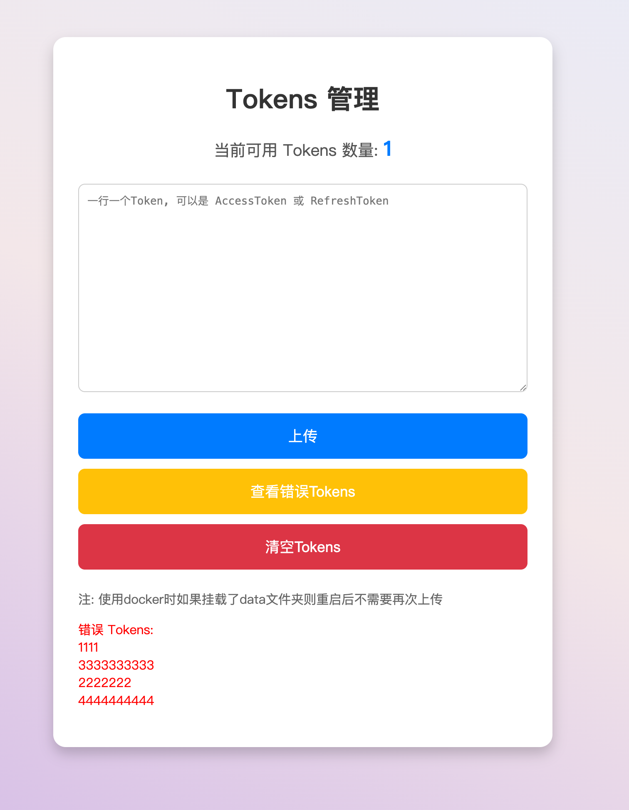

# NovelAPI

💥 支持 AccessToken 使用账号画图。

🔍 回复格式与真实 API 完全一致，适配几乎所有客户端

🔍 图片存放Alist平台，免存储！

### 逆向API 功能
> - [x] 对话式画图

### 改造功能
> - [x] 图片存放至Alist平台。
> - [x] 后台账号池随机抽取。
> - [x] 错误账号自动剔除禁用。
> - [x] /web 可直接进入Token管理页面。

> TODO
> - [ ] 暂无，欢迎提 `issue`

```bash
curl --location 'http://127.0.0.1:3388/v1/chat/completions' \
--header 'Content-Type: application/json' \
--header 'Authorization: Bearer {{Token}}' \
--data '{
     "model": "nai-diffusion-3",
     "messages": [{"role": "user", "content": "Say this is a test!"}],
     "stream": true
   }'
```

## Tokens 管理

1. 访问 `/web` ， 可以查看现有 Tokens 数量，也可以上传新的 Tokens ，或者清空 Tokens。


## 部署

### 部署AList
[安装Alist组件](https://www.master-jsx.top/archives/alistpan)

### 直接部署

```bash
git clone https://github.com/jingshaoxiang/novel-api.git
cd novel-api
# 填写config.yml中的环境变量，然后运行以下命令启动应用程序。
./novel-x86
```

### Docker 部署

您需要安装 Docker 和 Docker Compose。

```bash
# 请根据您自己的系统类型导入最新的包

docker load < ./docker/novel-x86.tar

docker-compose up -d # 启动容器
```
